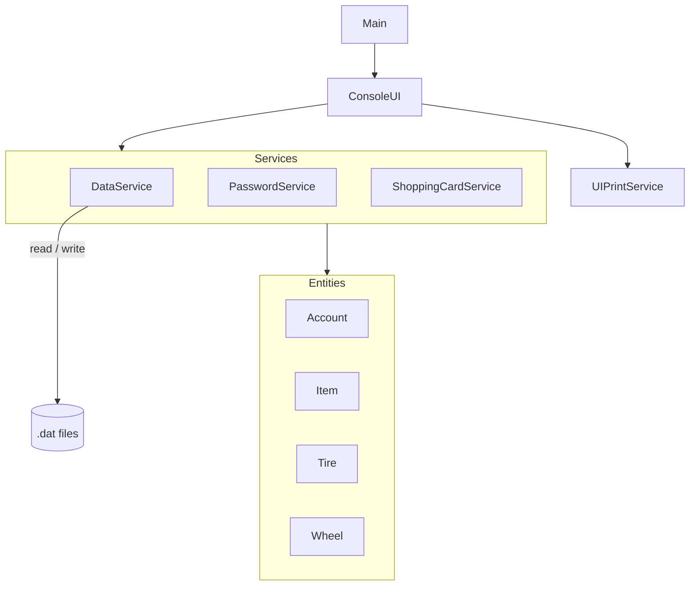

# Tire Shop (Console)

A console-based tire shop management application written in Java. Built as a learning
project to practice OOP, layered architecture, and data persistence — and as a scaffold
before rewriting it as a full-stack web application.

> **Status:** console version complete. Currently being rewritten as a Spring Boot + Vue
> web app — see ########.

## About

Tire Shop is a small CLI application that simulates a tire and wheel store with two kinds
of users — customers and an administrator. It started as a single monolithic console class
and was gradually refactored into a layered design (UI / services / domain), with a
dedicated persistence layer that mirrors the repository pattern the web version will use.

## Features

**Customer**
- Register and log in (passwords are hashed before storage)
- Browse available tires and wheels
- Add and remove items in a shopping cart
- View the cart with a running total
- Check out — balance and stock are updated per item, with out-of-stock and
  insufficient-funds cases handled individually

**Administrator**
- Add, edit and delete items
- View the full catalogue

**Catalogue** — two product types, each with its own attributes:
- **Tire** — size, speed rating, season
- **Wheel** — diameter, width, bolt pattern

## Tech stack

- **Language:** Java 17+
- **Persistence:** Java object serialization (`.dat` files)
- **IDE:** IntelliJ IDEA
- **Version control:** Git

## Project structure

```
TireProject/
├── ConsoleUI/
│   ├── ConsoleUI.java              # input / output, menu flow
│   ├── MenuOptions.java
│   └── UIPrintService/
│       └── PrintService.java       # console output
├── Entities/
│   ├── Account.java                # user + cart state
│   ├── Item.java                   # base product
│   ├── Tire.java
│   └── Wheel.java
├── Services/
│   ├── DataService.java            # load / save serialized data
│   ├── PasswordService.java        # password hashing
│   └── ShoppingCardService.java    # cart + purchase logic
├── InformationFiles/
│   ├── Accounts.dat                # seeded accounts
│   └── Items.dat                   # seeded catalogue
└── Main.java
```

Dependency direction is `ConsoleUI → Services → Entities`. Domain classes hold no business
logic — cart and purchase rules live in `ShoppingCardService`, persistence in `DataService`.



## Getting started

1. Open the project in IntelliJ IDEA.
2. Run `Main`.
3. Log in with the seeded admin account, or register a new customer.

Seeded data (`Accounts.dat`, `Items.dat`) ships with the repository, so the store is
already populated on first run.

### Default admin

```
username: Admin
password: qq
```

> Change these before using the project anywhere real.

## Known limitations

An honest list — most of these are resolved by the web rewrite:

- **Serialization persistence** — saved data is tied to class structure, so renaming or
  moving a class breaks existing `.dat` files. → moving to a relational database.
- **Role by username** — the admin is identified by the name `Admin` rather than a real
  role. → proper role-based authorization.
- **Password hashing** — SHA-256 without a salt. → BCrypt.
- **Data file paths** — resolved relative to the working directory. → gone once data lives
  in a database.

## Roadmap

Rewrite as a full-stack web application:

- [ ] JDBC persistence layer (`save` / `findById` / `findAll` / `deleteById`)
- [ ] Spring Boot + MySQL, JPA / Hibernate
- [ ] REST API + Spring Security (real roles, BCrypt password hashing)
- [ ] Vue 3 frontend (Pinia, Vue Router)
- [ ] Cloudinary for product images
- [ ] Order handling (Telegram bot + Nova Poshta)
- [ ] Docker deployment

## License
